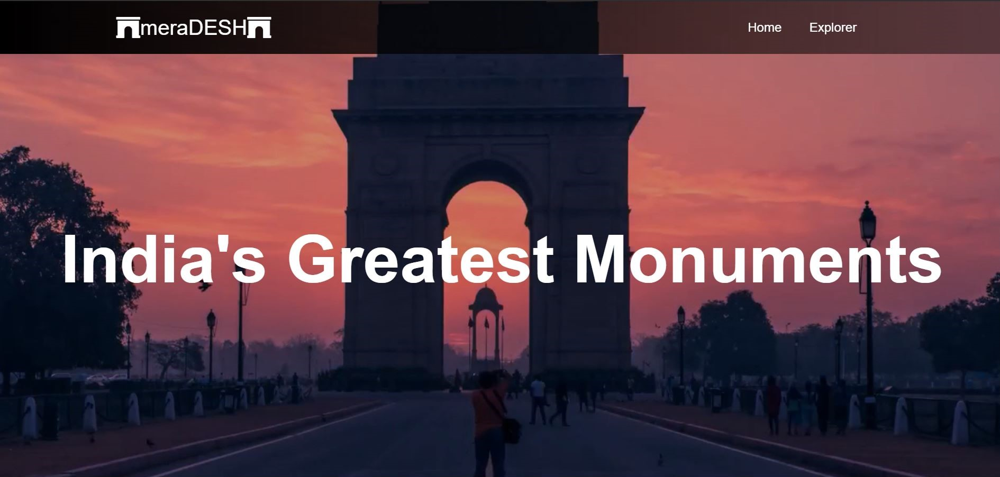
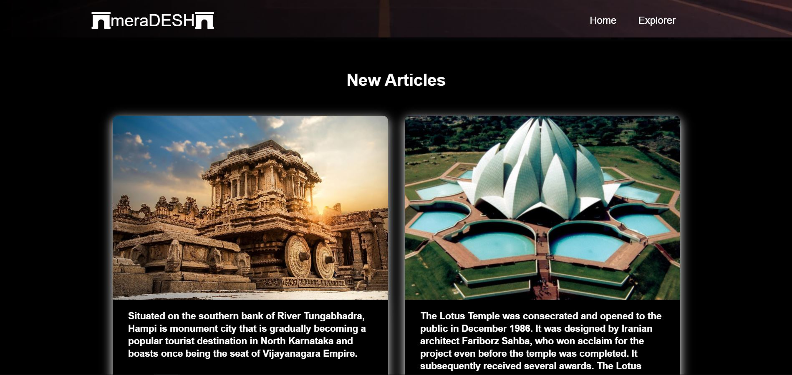
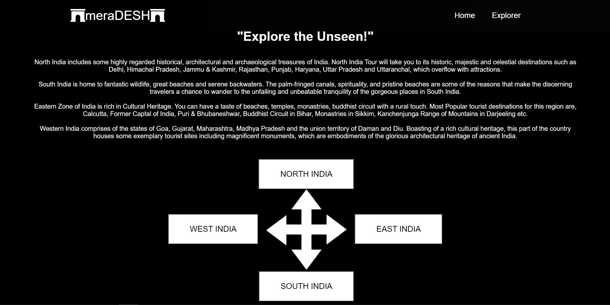
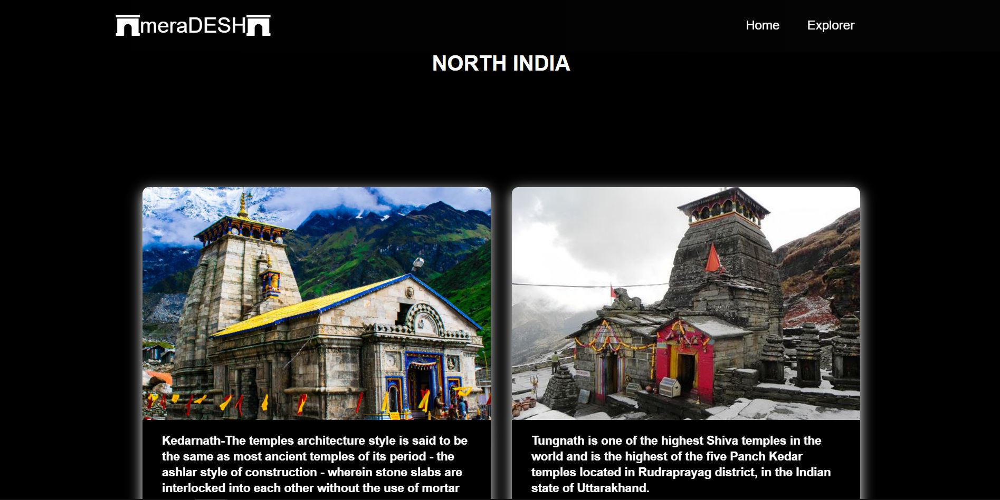

# Overview
Website based on react framework which depicts Indian Tourism. A local guide for all the magnificient places to be explored in India covering places from North to South and East to West. 

# Getting Started with React Website

Make sure you have installed comman react libraries.

#Commands 

1.npm install

2.npm install react-router-dom

# Website Demonstration

Main Page

Trending Articles

Explorer Page

